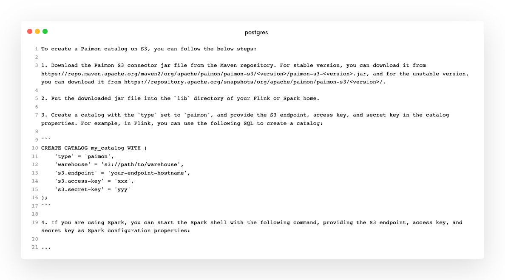

# Postgres-GPT Readme

Postgres-GPT is a Postgres UDF project that seamlessly integrates Postgres-Vector and OpenAI to establish a SQL-based knowledge repository from Markdown files.

With its document embedding functionality, this project enables users to effortlessly access relevant information directly from multiple documents in a natural language format.

For instance:

```sql
-- Generate document embedding
select ai_embedding_doc('/opt/gpt/incubator-paimon/docs', 'paimon');

-- Ask questions to documents in natural language 
select ai_ask_doc('paimon', 'How to create a Paimon catalog on S3?');
```



This project was inspired by [AskBend](https://github.com/datafuselabs/askbend) and [DataBend AI function](https://databend.rs/doc/sql-functions/ai-functions/) projects, for which I am very grateful to Databend for their exploration in this area.

<br/>

## Quick Start

### Installation

To run Postgres-GPT, which is an image that already includes all UDF functions and relevant plugins, you can use Docker.

```other
docker run --name postgres-gpt -p 5432:5432 \
-e OPENAI_API_KEY=<your openai-api key> \
-e POSTGRES_PASSWORD=postgres \
-d yulinying/postgres-gpt
```

Alternatively, you can use the [yulinying/postgres-gpt-playground](https://hub.docker.com/repository/docker/yulinying/postgres-gpt-playground) image that includes pre-embedded sample document data. For more information, please refer to the [Postgres-GPT-Playground](## About Postgres-GPT-Playground.


<br/>

### Natural Language Document Search

Build embedding for automatic document indexing and use natural language queries to return results based on the closest vector cosine distance to a few paragraphs of document content, which are reorganized into natural language answers.

1. Build document embedding, where `doc_dir` needs to be changed to a local path accessible by the postgres instance. This process takes a few minutes and needs to be executed only once unless the document changes occur.

```sql
select ai_embedding_doc('<doc_dir>', '<doc_name>');
```

2. Query documents:

```sql
select ai_ask_doc('<doc_name>', 'your question');
```


### Query Data in Natural Language

Explore data that exists in the database using natural language and automatically transform the intention into the corresponding SQL query using metadata from the database.

```sql
select ai_to_sql('<your prompt>');
```

<br/>

## About Postgres-GPT-Playground

`yulinying/postgres-gpt-playground` is a postgres-gpt image that has been pre-populated with sample data, including embedded documentation for the already constructed [apache/incubator-paimon](https://paimon.apache.org/docs/master/) project, and a set of datasets for testing `ai_to_sql` function.

```sql
-- run container
docker run --name postgres-gpt-playground -p 5432:5432 \
-e OPENAI_API_KEY=<your openai-api key> \
-e POSTGRES_PASSWORD=postgres \
-d yulinying/postgres-gpt-playground
```

Let's explore these data:

```sql
select ai_to_sql('List detailed information for the top 5 companies with the highest event budgets in 2017');
select ai_ask_doc('paimon', 'What is the purpose of the paimon?');
select ai_ask_doc('paimon', 'How to create a Paimon catalog on S3?');
```

<br/>

## Function List

### [ai_embedding_doc](postgres_gpt/ai_embedding_doc.sql)

Split all markdowns in the specified directory into embedding vectors and automatically store them in postgres.

```sql
ai_embedding_doc(doc_dir varchar, doc_table varchar)
```

**Parameters:**

   - `doc_dir`: the local file directory that needs to be built, which postgres can directly access;
   - `doc_table`: the name of the table where the document embedding is built, which will be automatically created;

**Example:**

```sql
select ai_embedding_doc('/opt/gpt/incubator-paimon/docs', 'paimon');
```

### [ai_ask_doc](postgres_gpt/ai_ask_doc.sql)

Search for the text closest to the question as a prompt from the vector results stored in doc_table and obtain an answer through openai.

```sql
ai_ask_doc(doc_table varchar, question varchar, max_token integer, mode varchar )
```

**Parameters:**

- `doc_table`: the name of the table where the document embedding has been built;
- `question`: the user's natural language question;
- `max_token`: the maximum length of the answer text in tokens;
- `mode`: the openai model used, which includes the following optional values:
   - `v1`: Use the text-davinci-003 model based on Completion API;
   - `v2` (default): Use gpt-3.5-turbo model based on ChatCompletion API;

**Example:**

```sql
select ai_ask_doc('paimon', 'What is the purpose of the paimon?');
```


### [ai_to_sql](postgres_gpt/ai_to_sql.sql)

Generate the corresponding query SQL based on natural language, using metadata in the specified schema.

```sql
ai_to_sql(prompt varchar, schema varchar)
```

**Parameters:**

- `prompt`: the data query requirement described in natural language
- `schema`: target schema name.

**Example:**

```sql
select ai_to_sql('List detailed information for the top 5 companies with the highest event budgets in 2017');

-- result:
SELECT c.name, SUM(cam.monthly_budget) AS total_budget
FROM companies c
INNER JOIN campaigns cam ON c.id = cam.company_id
WHERE cam.updated_at >= '2017-01-01' AND cam.updated_at < '2018-01-01'
GROUP BY c.name
ORDER BY total_budget DESC
LIMIT 5;
```

<br/>

## Manual Installation

postgres-gpt is actually composed of a series of pl/python functions that can be easily installed on an existing postgres instance.

1. Install the following postgres plugins:
   - pgvector
   - plpython3u
2. Install the following python libraries:
   - markdown-it-py
   - openai[datalib]

```sql
pip install 'openai[datalib]' markdown-it-py
```

3. Execute all sql scripts under the postgres_gpt directory on the corresponding postgres database.

<br/>

## Docker Build

```sql
docker build .
```

